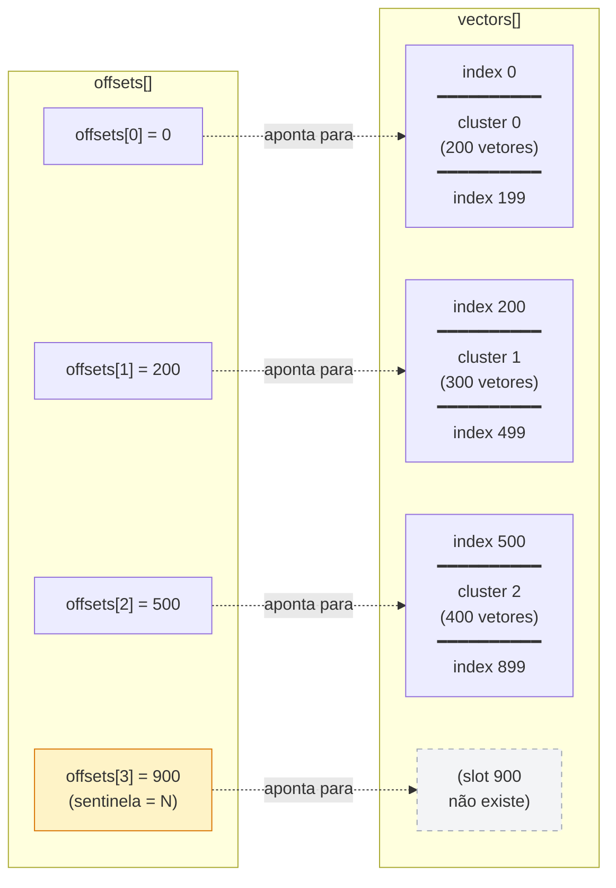

# Layout binário do índice IVF

Arquivo persistido após o k-means; lido pelo runtime da API a cada query.

## Estrutura

| Bloco | Tamanho | Conteúdo |
|---|---|---|
| **HEADER** | 12 B | `K` (uint32), `D` (uint32), `N` (uint32) |
| **CENTROIDS** | `K · D · 4` B | `K` centróides, cada um com `D` floats |
| **OFFSETS** | `(K+1) · 4` B | prefix-sum: `offsets[j]` = índice do 1º vetor do cluster `j`; `offsets[K] = N` (sentinela) |
| **VECTORS** | `N · D · 4` B | os `N` vetores de referência, **ordenados por cluster** |
| **LABELS** | `N` B | `0 = legit`, `1 = fraud`, mesma ordem dos vetores |

**Tamanhos concretos** (K=1700, N=3M, D=14):

| Bloco | Tamanho |
|---|---|
| HEADER | 12 B |
| CENTROIDS | ~95 KB |
| OFFSETS | ~6.8 KB |
| VECTORS | **~168 MB** |
| LABELS | ~3 MB |
| **Total** | **~171 MB** |

---

## Por que esse layout

Cada bloco foi escolhido pra favorecer um passo do fluxo de query:

```
1. Lê query (14 floats)
2. Calcula distância da query pra TODOS os K centróides → escolhe o mais próximo
3. Pega a inverted list desse centróide
4. Calcula distância da query pra cada vetor da lista
5. Top-5 → conta fraud/legit → resposta
```

### CENTROIDS contíguos

Passo 2 percorre `K` centróides em sequência. Memória contígua = **cache-friendly** (com K=1700 e D=14, o bloco ocupa ~95 KB → cabe inteiro em L2). Prefetch do CPU acerta sempre.

### OFFSETS como prefix-sum + sentinela

Passo 3 precisa achar "onde começa e termina o cluster `j`". Com prefix-sum:

```
size(j) = offsets[j+1] - offsets[j]
```

Mesma fórmula pra todo `j`, **sem caso especial** pro último cluster. A sentinela `offsets[K] = N` é o slot imaginário logo após o último vetor; existe só pra fórmula fechar.

Acesso é `O(1)`: dois lookups e uma subtração. Sem busca linear.

### VECTORS ordenados por cluster

Passo 4 lê **só os vetores de um cluster**. Se eles estivessem espalhados pela memória (na ordem original do dataset), seria salto de cache constante.

Ordenando por cluster, cada `inverted_list[j]` vira **um intervalo contíguo de memória**. Leitura sequencial = prefetch automático do CPU. Em ~1700 vetores por cluster (média), isso são ~95 KB de leitura linear por query.

### LABELS separados dos vetores

Distância só usa os 14 floats do vetor. Se label estivesse colado em cada entrada (`{vector, label}`), a estrutura ocuparia mais espaço por entrada e **a cache se enche mais rápido** com bytes que o passo 4 nem usa.

Com labels separados:
- Passo 4 lê só vetores → mais densidade na cache
- Passo 5 (top-5) acessa labels uma vez por candidato → ~5 lookups, custo desprezível

---

## Como `offsets` aponta pros vetores

Exemplo didático: `K=3`, `N=900`, com clusters de tamanhos 200, 300, 400.



**Cálculo do tamanho usando a sentinela:**

| Cluster | Fórmula | Resultado |
|---|---|---|
| 0 | `offsets[1] - offsets[0] = 200 - 0` | 200 ✓ |
| 1 | `offsets[2] - offsets[1] = 500 - 200` | 300 ✓ |
| 2 | `offsets[3] - offsets[2] = 900 - 500` | **400 ✓** ← usa a sentinela |

Sem `offsets[3]`, o cluster 2 precisaria de `if (j == K-1) size = N - offsets[j]`. Com ela, a regra é uniforme.

---

## Pontos de atenção

- **168 MB de vetores** é quase o limite de 160 MB por instância da API. Compressão (ex: Product Quantization) ou `mmap` compartilhado entre os dois processos provavelmente serão necessários.
- Layout assume **little-endian** (x86_64, arm64). Se um dia for portar pra outra arq, padronize com `htole32` etc.
- Não há padding/alinhamento explícito. Floats têm alinhamento natural de 4 B desde que o início de cada bloco esteja alinhado — o que vale aqui porque cada bloco começa em offset múltiplo de 4.
